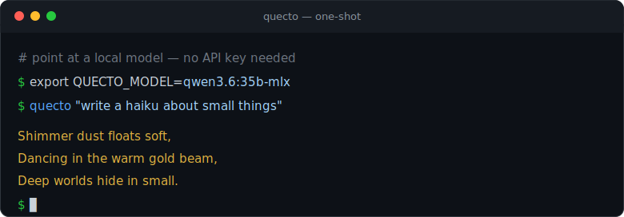
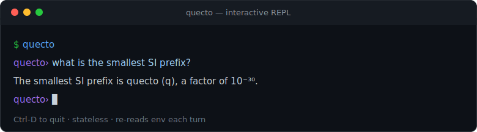

<div align="center">

# quecto

### The leanest, fastest, smallest AI harness — and the coding agent built on it.

*One endpoint. Zero async. A 1.2 MB core, a 3.3 MB agent — both shipped.*

<br/>

[](#-the-moat-12-mb-core-33-mb-agent)

[](LICENSE)
[](#dependencies)
[](#philosophy)
[](https://www.rust-lang.org)
[](#testing)
[](#status)

</div>

---

`quecto` — the [SI metric prefix](https://en.wikipedia.org/wiki/Metric_prefix) for **10⁻³⁰**, the smallest unit in the metric system. If *kilo* is 10³ and *quecto* is 10⁻³⁰, this project lives at the extreme: a universal harness built from the smallest possible composable units — and the proof that "smallest" scales all the way up to a full coding agent.

**Two crates, one philosophy:**

- **`quecto`** — the core. Take a prompt, run it through any OpenAI-compatible LLM — cloud (OpenAI) or local (Ollama, LM Studio, vLLM) — and return the output, buffered or streamed. One job, zero opinions.
- **`quecto-agent`** — the coding agent, built entirely on top of the core. Multi-step tool use, file edits under approval, a hard-denylist sandbox, verification gates, session persistence (resume/undo/diff), and named "flavor" manifests with trust-on-first-use — all in a **3.3 MB** binary with **no async runtime**.

---

## Demo

**One-shot** — a prompt in, streamed output out (here against a local Ollama model, no API key):

<div align="center">
  
</div>

**Interactive REPL** — stateless turns, `Ctrl-D` to quit:

<div align="center">
  
</div>

<sub>Real output captured from `quecto` running against `qwen3.6:35b-mlx` on Ollama.</sub>

---

## 📣 Announcements

- **`2026-07-12` — `quecto-agent` shipped (M1–M7b).** The full coding agent — tool use, editing under approval, sandbox denylist, verification gates, session persistence (resume/undo/diff), and manifest flavors with trust-on-first-use — is complete and merged to `main`.
- **`2026-07-12` — UAT accepted.** 41 black-box scenarios across CLI, chat, tools, persistence, and flavors run against a live model: 34 pass, 7 minor polish partials, **0 failures, 0 blocking defects**. See [`docs/UAT-report.md`](docs/UAT-report.md).
- **`2026-07-10` — Core crate landed.** The full `quecto` core: four-function library API, streaming with SSE + non-SSE fallback, and a one-shot / REPL / `--init` CLI. 24 tests, clippy-clean, two dependencies.
- **`2026-07-10` — Size-optimized build.** A tuned release profile ships both binaries statically-linked, no runtime: the core at **~1.2 MB**, the agent at **~3.3 MB**.
- **Next up — `quecto-mcp`.** MCP server/client integrations are planned as the next companion crate.

---

## 🛡️ The Moat: 1.2 MB core, 3.3 MB agent

Both binaries are **self-contained** — no runtime, no interpreter, statically-linked rustls TLS:

| Build | Size |
|---|---:|
| `quecto` — default `--release` | 2.6 MB |
| `quecto` — stripped | 2.3 MB |
| **`quecto` — size-optimized profile (shipped)** | **~1.2 MB** (1,300,896 bytes) |
| **`quecto-agent` — size-optimized profile (shipped)** | **~3.3 MB** (3,456,240 bytes) |

Two direct dependencies on the core (`ureq` + `serde_json`), ~30 transitive crates, **no `tokio`, no `reqwest`, no async runtime.** The agent adds a full tool loop, sandbox, SQLite-backed session store, and manifest parsing — and still fits in 3.3 MB. Small is the feature, at every layer.

---

## Quick start

```bash
# Build the ~1.2 MB binary
git clone https://github.com/adityak74/quecto
cd quecto
cargo build --release      # → target/release/quecto

# target/release isn't on $PATH by default — either call it directly:
./target/release/quecto "write me a haiku about small things"

# ...or install it onto $PATH first, then call it as `quecto`:
cargo install --path . --force
quecto "write me a haiku about small things"

# Interactive REPL (Ctrl-D to quit)
quecto

# Bootstrap your environment (prints eval-able exports)
eval "$(quecto --init)"
```

Point it anywhere OpenAI-compatible — **no API key needed for local models:**

```bash
# Local (Ollama / LM Studio / vLLM)
export QUECTO_BASE_URL="http://localhost:11434/v1"
export QUECTO_MODEL="qwen2.5-coder"
quecto "refactor this function"

# Cloud (OpenAI)
export QUECTO_BASE_URL="https://api.openai.com/v1"
export QUECTO_API_KEY="sk-..."
export QUECTO_MODEL="gpt-4o"
```

### Configuration

| Variable | Default | Purpose |
|---|---|---|
| `QUECTO_BASE_URL` | `https://api.openai.com/v1` | OpenAI-compatible endpoint |
| `QUECTO_API_KEY` | *(optional)* | Bearer token; omit for local servers |
| `QUECTO_MODEL` | `gpt-4o` | Model name |
| `QUECTO_SYSTEM` | *(optional)* | System prompt, prepended as a `{role:system}` message |
| `QUECTO_STREAM` | `1` | `0` uses the buffered path instead of streaming |

---

## `quecto-agent` — the coding agent

Built entirely on the core's `quecto_raw` primitive: same zero-async, statically-linked philosophy, scaled up to a full agent loop.

```bash
cargo build --release -p quecto-agent   # → target/release/quecto-agent (~3.3 MB)

# target/release isn't on $PATH by default — either call it directly:
./target/release/quecto-agent "add a test for the parse_args function"

# ...or install it onto $PATH first, then call it as `quecto-agent`:
cargo install --path quecto-agent --force
quecto-agent "add a test for the parse_args function"

# Interactive chat
quecto-agent chat

# Resume / undo / diff a previous session
quecto-agent resume <session-id>
quecto-agent undo
quecto-agent diff
```

**What's in it:** multi-step tool use (file read/write/patch, search, git, shell), edits gated by an approval preset, a hard-denylist sandbox (blocks `sudo`, `rm -rf /`, `git push`, etc. even under `--yes`), configurable verification commands, SQLite-backed session persistence, and named flavor manifests (`.quecto/flavors/*.toml`) with content-hash trust-on-first-use.

### Configuration

Reads the same core env vars as `quecto`, plus a few agent-specific ones:

| Variable | Default | Purpose |
|---|---|---|
| `QUECTO_BASE_URL` | `http://localhost:11434/v1` | OpenAI-compatible endpoint — **note: defaults to local Ollama**, unlike the core's `api.openai.com` default |
| `QUECTO_API_KEY` | *(optional)* | Bearer token; omit for local servers |
| `QUECTO_MODEL` | *(none — required)* | Model name; no built-in fallback |
| `QUECTO_SYSTEM` | built-in agent system prompt | Overrides the base system prompt (repo rules + seed context are still appended after it) |
| `QUECTO_MAX_STEPS` | `20` | Cap on agent loop steps |
| `QUECTO_VERIFY` | *(unset)* | Newline-separated shell commands run as a post-edit verification gate |
| `QUECTO_STATE_DB` | `$XDG_STATE_HOME/quecto/sessions.db` (falls back to `~/.local/state/...`) | SQLite session store path |
| `QUECTO_TRUST_FILE` | `$XDG_STATE_HOME/quecto/trust` (falls back to `~/.local/state/...`) | Trust-on-first-use hash store for flavor manifests |

```bash
# Local (Ollama / LM Studio / vLLM) — QUECTO_BASE_URL already defaults here
export QUECTO_MODEL="qwen2.5-coder"
quecto-agent "add a test for the parse_args function"

# Cloud (OpenAI)
export QUECTO_BASE_URL="https://api.openai.com/v1"
export QUECTO_API_KEY="sk-..."
export QUECTO_MODEL="gpt-4o"
```

See [`docs/UAT-report.md`](docs/UAT-report.md) for the full acceptance test results, and `docs/superpowers/` for the milestone specs and plans (M1–M7b).

**A note on small local models:** tool-call reliability is the model's job, not the agent's — `quecto-agent` executes whatever `tool_calls` the model returns and does nothing when it returns none. Small quantized models (e.g. 2B-parameter local models) are inconsistent at this: the same prompt may get answered with plain text ("I'll create the file...") instead of an actual `write_file` call, or may target the wrong path. Watch for a `● tool_name ...` activity line to confirm a tool actually ran. For reliable multi-step tool use, prefer a larger tool-tuned model (e.g. `qwen2.5-coder`, `qwen2.5:7b-instruct`, or a 30B+ model like `qwen3.6:35b`).

**A note on approval in `chat`:** by default `quecto-agent chat` asks for approval before writes/commands and shows `● tool_name  denied` if none is given (there's no way to approve mid-turn over a non-interactive pipe, so the model typically falls back to a manual snippet). Type `/approve` inside the session to approve edits and commands for the rest of that session, or start with `quecto-agent chat --yes` to skip asking entirely.

### Session storage — what's kept and where

**In memory (per run):** the `Agent` holds the full transcript — system prompt, every user message, assistant reply, tool call, and tool result — and resends all of it to the model on each turn. This is what gives `chat` its conversational context.

**On disk (persisted, plaintext):** when a session store is available (default `~/.local/state/quecto/sessions.db`, or `$QUECTO_STATE_DB`), every message is written to a SQLite `messages` table keyed by session id — role, content, tool calls, and tool results included. File edits are recorded separately in a `file_changes` table. This is what powers `resume`, `undo`, and `diff`.

There's no encryption or expiry on that store — it's a local dev database, not a hardened secrets store. Avoid pasting anything sensitive into a session, or point `QUECTO_STATE_DB` at somewhere ephemeral (e.g. `/tmp`) if you need to.

---

## Library API

Four functions: two opinion-free primitives and two conveniences layered on top.

```rust
// Primitives — you supply the exact URL, headers, and JSON body.
quecto_raw(url, headers, body)                 -> Result<Value, _>   // buffered
quecto_stream(url, headers, body, on_delta)    -> Result<String, _> // streamed (SSE)

// Conveniences — OpenAI-flavored sugar over the primitives.
quecto_to(prompt, base_url, api_key, model)    -> Result<String, _>
quecto(prompt)                                 -> Result<String, _> // reads env
```

```rust
fn main() -> Result<(), Box<dyn std::error::Error + Send + Sync>> {
    let reply = quecto::quecto("What is the smallest SI prefix?")?;
    println!("{reply}");
    Ok(())
}
```

Because the primitives neither shape the request nor discard the response, you can pass a `tools` array and read `tool_calls` straight off the returned `Value` — the only hook an agent layer needs.

---

## Use it for

- **Agents** — multi-step reasoning, tool use, autonomous workflows
- **Data** — extract, transform, classify, summarize at scale
- **Code** — scaffolding, refactoring, reviews, tests
- **Content** — writing, editing, SEO, translation, formatting
- **Research** — fact-checking, synthesis, comparison, deep-dive
- **Anything** — if an LLM can reason through it

---

## Philosophy

```
… → mega (10⁶) → kilo (10³) → base → milli (10⁻³) → micro (10⁻⁶) → … → quecto (10⁻³⁰)
```

1. **LLMs are the backend.** The harness is just the glue.
2. **Everything is composable.** Small pieces → big things.
3. **Describe it, run it.** If you can explain it to an LLM, quecto handles it.

`quecto` is the smallest possible unit. This project takes that literally: break any task down to its smallest composable piece, then compose them back up. The primitives decide nothing; every opinion is optional sugar you can bypass.

---

## Roadmap

| Component | Home | Status |
|---|---|---|
| Model adapter (talk to the model) | **`quecto` core** | ✅ shipped |
| Agent loop · tools · sandbox · verify · session · flavors/trust | `quecto-agent` | ✅ shipped, UAT accepted |
| MCP integrations | `quecto-mcp` | 🔮 planned |

The core never gains an async runtime, tool execution, or state — companions build on top of `quecto_raw`.

---

## Dependencies

```toml
ureq = { version = "2", features = ["json"] }   # synchronous HTTP (rustls TLS)
serde_json = "1"                                 # build bodies, parse responses
```

## Testing

```bash
cargo test --workspace   # 179 tests across both crates, clippy-clean
cargo test               # 24 tests: unit + HTTP + streaming + CLI (core only, dependency-free mock server)
cargo clippy --all-targets --workspace
```

## Status

**`quecto` core and `quecto-agent` are both shipped and UAT-accepted.** Still an early, actively-developed project, built in the open.

---

## Star history

<a href="https://star-history.com/#adityak74/quecto&Date">
  
</a>

⭐ **Be the first star** — the full history chart renders [here](https://star-history.com/#adityak74/quecto&Date) once the repo has stargazers.

---

## License

Released under the **[MIT License](LICENSE)** — do whatever you want with it, just keep the copyright notice.

© 2026 Aditya
