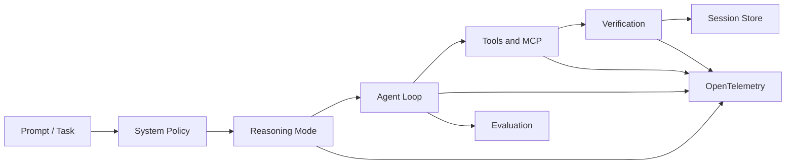
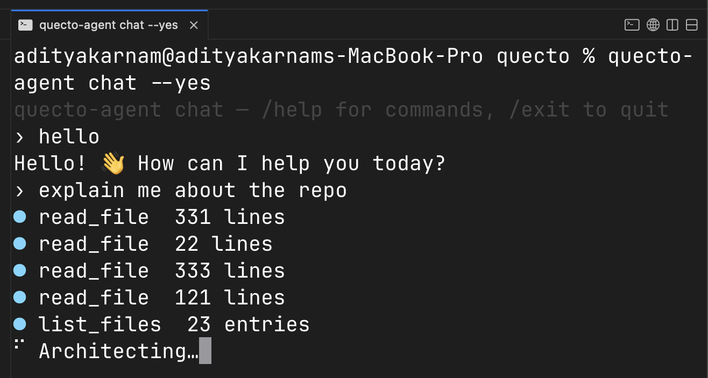

<div align="center">

# quecto

### A minimal, vendor-neutral execution layer for LLM agents.

*One endpoint. Zero async. A 1.3 MB core and a 3.5 MB coding agent.*
*Reasoning controls, tools, verification, persistence, MCP, evaluation, and OpenTelemetry.*

<br/>

[](#small-by-construction)

[](https://github.com/adityak74/quecto/releases/tag/quecto-v0.1.0)
[](https://github.com/adityak74/quecto/releases/tag/quecto-agent-v0.1.0)
[](LICENSE)
[](#dependencies)
[](#architecture-principles)
[](https://www.rust-lang.org)
[](#testing-and-contributing)
[](#evaluation)
[](#status)

</div>

> 📦 **First official releases are out.** [`quecto v0.1.0`](https://github.com/adityak74/quecto/releases/tag/quecto-v0.1.0) and [`quecto-agent v0.1.0`](https://github.com/adityak74/quecto/releases/tag/quecto-agent-v0.1.0) are tagged with prebuilt `aarch64-apple-darwin` binaries — grab them from the Releases page or build from source below.

---

`quecto` — the [SI metric prefix](https://en.wikipedia.org/wiki/Metric_prefix) for **10⁻³⁰**, the smallest unit in the metric system. This project takes that literally: a minimal, vendor-neutral execution layer for LLM agents, built from the smallest possible composable units — and proof that "minimal" scales all the way up to a complete, observable coding agent.

**Two crates, one philosophy:**

- **`quecto`** — the core. Take a prompt, run it through any OpenAI-compatible LLM — cloud (OpenAI) or local (Ollama, LM Studio, vLLM) — and return the output, buffered or streamed. One job, zero opinions.
- **`quecto-agent`** — a real coding agent, built entirely on top of the core. Multi-step tool use, native reasoning controls, verification gates, session persistence (resume/undo/diff), MCP tool sources, OpenTelemetry tracing, and a deterministic evaluation suite — all in a **3.5 MB** binary with **no async runtime**.

---

## Why QuECTO?

LLM agents are increasingly defined by the harness around the model: system prompts, reasoning controls, tools, verification, memory, execution policy, and telemetry.

Most agent frameworks bundle these concerns into a large runtime and impose their own abstractions on top of the model API.

QuECTO takes the opposite approach:

- keep the model interface minimal;
- make every policy replaceable;
- preserve model responses instead of hiding them;
- expose reasoning, execution, and verification through observable primitives;
- scale from one synchronous request to a complete coding agent.

---

## Architecture



| Layer          | Purpose                                                                             |
| -------------- | ------------------------------------------------------------------------------------ |
| `quecto`       | Minimal synchronous model transport and raw primitives                              |
| `quecto-agent` | Tools, reasoning controls, verification, persistence, telemetry, evaluation, and MCP |

---

## Demo

**One-shot** — a prompt in, streamed output out (here against a local Ollama model, no API key):

<div align="center">
  
</div>

**Interactive REPL** — stateless turns, `Ctrl-D` to quit:

<div align="center">
  
</div>

<sub>Real output captured from `quecto` running against `qwen3.6:35b-mlx` on Ollama.</sub>

---

## What's new

- **First official releases:** [`quecto v0.1.0`](https://github.com/adityak74/quecto/releases/tag/quecto-v0.1.0) and [`quecto-agent v0.1.0`](https://github.com/adityak74/quecto/releases/tag/quecto-agent-v0.1.0), tagged with prebuilt macOS (arm64) binaries.
- **Multimodal input:** `quecto-agent` accepts `--image` for vision-capable models.
- **Reasoning controls:** session-scoped `none` through `xhigh`, persisted across resume.
- **Agent telemetry:** OTEL spans for runs, steps, tools, completions, and reasoning traces.
- **MCP support:** STDIO and Streamable HTTP tool servers.

See [CHANGELOG.md](CHANGELOG.md) for the complete release history.

---

## Quick start

```bash
git clone https://github.com/adityak74/quecto
cd quecto
cargo build --release -p quecto-agent
export QUECTO_MODEL=qwen2.5-coder
./target/release/quecto-agent chat
```

Then, inside the chat session:

```text
/reasoning high
/approve
Add tests for the parser and run them.
```

<details>
<summary><strong>Local model</strong> — Ollama, LM Studio, vLLM (no API key)</summary>

```bash
export QUECTO_BASE_URL="http://localhost:11434/v1"   # quecto-agent defaults here already
export QUECTO_MODEL="qwen2.5-coder"
quecto-agent "refactor this function"
```

</details>

<details>
<summary><strong>Cloud model</strong> — OpenAI or any OpenAI-compatible endpoint</summary>

```bash
export QUECTO_BASE_URL="https://api.openai.com/v1"
export QUECTO_API_KEY="sk-..."
export QUECTO_MODEL="YOUR_OPENAI_CHAT_MODEL"
quecto-agent "refactor this function"
```

</details>

<details>
<summary><strong>Library API</strong> — embed the core directly in Rust</summary>

```rust
fn main() -> Result<(), Box<dyn std::error::Error + Send + Sync>> {
    let reply = quecto::quecto("What is the smallest SI prefix?")?;
    println!("{reply}");
    Ok(())
}
```

See [Library API](#library-api) below for the full four-function surface.

</details>

Prefer the core alone, or the raw CLI without building from source? See [Building the core](#quecto-core) and [Configuration reference](#configuration-reference).

---

## What you get

| Capability                      | Core | Agent |
| -------------------------------- | :--: | :---: |
| OpenAI-compatible endpoints     |   ✓  |   ✓   |
| Local and cloud models          |   ✓  |   ✓   |
| Synchronous streaming           |   ✓  |   ✓   |
| System-prompt override          |   ✓  |   ✓   |
| Native reasoning modes          |   —  |   ✓   |
| Multi-step tool execution       |   —  |   ✓   |
| Verification gates              |   —  |   ✓   |
| Session resume/undo/diff        |   —  |   ✓   |
| Reasoning-trace persistence     |   —  |   ✓   |
| OpenTelemetry                   |   —  |   ✓   |
| MCP tools                       |   —  |   ✓   |
| Harbor / Terminal-Bench adapter |   —  |   ✓   |

---

## `quecto` core

Built entirely on the core's `quecto_raw` primitive: same zero-async, statically-linked philosophy, scaled up to a full agent loop below.

```bash
# Build the ~1.3 MB binary
cargo build --release      # → target/release/quecto

# target/release isn't on $PATH by default — either call it directly:
./target/release/quecto "write me a haiku about small things"

# ...or install it onto $PATH first, then call it as `quecto`:
cargo install --path . --force
quecto "write me a haiku about small things"

# Interactive REPL (Ctrl-D to quit)
quecto

# Bootstrap your environment (prints eval-able exports)
eval "$(quecto --init)"
```

---

## `quecto-agent` — the coding agent

```bash
cargo build --release -p quecto-agent   # → target/release/quecto-agent (~3.5 MB)

# target/release isn't on $PATH by default — either call it directly:
./target/release/quecto-agent "add a test for the parse_args function"

# ...or install it onto $PATH first, then call it as `quecto-agent`:
cargo install --path quecto-agent --force
quecto-agent "add a test for the parse_args function"

# Interactive chat
quecto-agent chat

# Resume / undo / diff a previous session
quecto-agent resume <session-id>
quecto-agent undo
quecto-agent diff

# Show version
quecto-agent --version
```

Interactive chat with the rotating loading verbs:



**Chat REPL commands** (type inside an active `chat` session):

| Command | Aliases | Description |
|---|---|---|
| `/help` | `/h`, `/?` | Show this command list |
| `/commands` | `/tools` | List available tools registered for this session |
| `/model` | — | Show the active model name |
| `/context` | — | Show session ID, message count, and approx. character count |
| `/status` | — | Show session ID and current status |
| `/diff` | — | Summarise file changes made this session |
| `/undo` | — | Revert the last recorded file change |
| `/approve` | — | Auto-approve all edits and shell commands for this session |
| `/deny` | — | Deny all edits and shell commands for this session |
| `/clear` | — | Forget the conversation (keeps the system prompt) |
| `/reasoning` | — | Show the active session reasoning mode |
| `/reasoning <mode>` | `/reasoning off` | Set or clear the reasoning default for future turns in this chat session |
| `/exit` | `/quit`, `/q` | Leave chat |

**What's in it:** multi-step tool use (file read/write/patch, search, git, shell, background processes, `.qkb` notes, subagent delegation), edits gated by an approval preset, a hard-denylist sandbox (blocks `sudo`, `rm -rf /`, `git push`, etc. even under `--yes`), configurable verification commands, SQLite-backed session persistence, named flavor manifests (`.quecto/flavors/*.toml`) with content-hash trust-on-first-use, session-scoped reasoning defaults, interactive markdown rendering, and inline Mermaid rendering for fenced `mermaid` code blocks in TTY chat.

**Subagent delegation:** `invoke_subagent` runs a subagent synchronously and blocks until it finishes. For running more than one at a time, `spawn_subagent` starts a subagent on a background thread and returns immediately with an id (up to 8 concurrent); `monitor_subagents` reports status, elapsed time, and recent activity for one or all spawned subagents; `cancel_subagent` stops one early.

A note on small local models: tool-call reliability is the model's job, not the agent's — `quecto-agent` executes whatever `tool_calls` the model returns and does nothing when it returns none. Small quantized models are inconsistent at this. For reliable multi-step tool use, prefer a larger tool-tuned model (e.g. `qwen2.5-coder`, `qwen2.5:7b-instruct`, or a 30B+ model like `qwen3.6:35b`).

---

## Reasoning controls and traces

QuECTO separates three concepts:

1. **Reasoning configuration** — the requested native reasoning effort.
2. **Reasoning content** — provider-exposed reasoning or thinking output.
3. **Execution behavior** — tool calls, edits, verification, retries, and outcomes.

### Native mode control

```text
none · minimal · low · medium · high · xhigh
```

### Per-session control

```text
/reasoning high
/reasoning off
```

### Per-completion control

```rust
CompletionOptions {
    reasoning_mode: Some(ReasoningMode::High),
}
```

### Provider boundary

QuECTO normalizes the user-facing reasoning mode, but provider adapters decide how — or whether — that mode can be represented by a particular endpoint. QuECTO sends the normalized mode as `reasoning_effort` only to OpenAI-compatible Chat Completions endpoints; unsupported controls fail explicitly rather than being silently simulated.

### What reasoning capture actually means

QuECTO captures reasoning only when the provider exposes it through the API, such as a `reasoning_content` field or model-generated `<think>` blocks. It does not recover private or hidden reasoning that the provider does not return. For providers that expose only reasoning-token counts or summaries, QuECTO records only those available signals.

### Captured telemetry

- requested reasoning mode
- provider reasoning content
- reasoning timestamps
- completion metadata
- tool execution
- verification result
- cost and token metadata where available

---

## Verified completion

QuECTO can run deterministic post-edit checks before a task is considered complete:

```bash
export QUECTO_VERIFY=$'cargo fmt --check\ncargo test\ncargo clippy'
```

Verification produces an observable execution result rather than relying only on the model's claim that the task is complete.

---

## Telemetry and observability

When compiled with the optional `otel` feature flag, `quecto-agent` supports end-to-end tracing via OpenTelemetry over OTLP/HTTP:

```bash
cargo build --release -p quecto-agent --features otel

export OTEL_EXPORTER_OTLP_ENDPOINT="http://localhost:4318"
./target/release/quecto-agent "some task"
```

### Event hierarchy

```text
agent_run
├── model_completion
│   ├── reasoning_mode
│   ├── reasoning_tokens
│   └── model_thinking
├── agent_step
│   ├── tool_execute
│   ├── tool_result
│   └── verification
└── session_persist
```

### Representative attributes

| Span/event         | Key attributes                             |
| ------------------ | ------------------------------------------- |
| `agent_run`        | model, endpoint, session ID, prompt hash   |
| `model_completion` | reasoning mode, token counts, latency      |
| `model_thinking`   | provider format, content length, persisted |
| `tool_execute`     | tool name, sanitized arguments, duration   |
| `verification`     | command, exit code, pass/fail              |
| `agent_step`       | step number, termination reason            |

Secrets, passwords, and tokens matching standard environment patterns (e.g. `API_KEY`, `PASSWORD`) are automatically redacted from trace attributes and event logs. Large argument payloads (like tool command strings or files) are sanitized to prevent memory overhead and data leakage.

---

## MCP

Build the agent with MCP support to consume any MCP-compatible server as a tool source:

```bash
# Build with MCP (~6–9 MB with tokio)
cargo build --release -p quecto-agent --features mcp

# Local STDIO server
quecto-agent --mcp stdio:filesystem:npx:-y:@modelcontextprotocol/server-filesystem:/tmp "list files"

# Remote Streamable HTTP server (current standard)
quecto-agent --mcp streamable_http:github:https://api.githubcopilot.com/mcp/ "open issues"

# Or configure in .quecto/mcp.toml
```

MCP tools are prefixed `mcp__<server>__<tool>` — no collision with native tools. Server failures at startup are non-fatal.

| Transport | When to use |
|---|---|
| `stdio` | Local single-user tools (Claude Desktop / Cursor pattern) |
| `streamable_http` | Remote/production (current MCP standard, March 2025+) |
| `sse` | Legacy servers only — deprecated, compat support |

---

## Evaluation

QuECTO ships a self-contained evaluation harness to measure coding-agent quality on local models: **deterministic smoke suite + Terminal-Bench 2.x adapter.**

- **Smoke suite** (`evals/smoke/`, 10 tasks) — regression and development testing, no LLM judge required. Each task has a `verify.sh` that exits 0 on pass:

  ```bash
  ./evals/run_evals.sh
  ```

  Use `--llm-judge` to override with a model judge (requires `OPENROUTER_API_KEY`) as an optional qualitative check on top of the deterministic verifier.

- **Terminal-Bench 2.x** — external, independent evaluation via [Harbor](https://harborframework.com)'s `BaseInstalledAgent` adapter (`evals/harbor/quecto_agent.py`), covering the full 89-task benchmark:

  ```bash
  pip install harbor
  harbor run -d terminal-bench/terminal-bench-2 -m qwen3.6:35b-mlx \
    --agent evals.harbor.quecto_agent:QuectoAgent
  ```

The 10-task smoke suite establishes local regression coverage, not broad coding-agent quality — Terminal-Bench is the credible external benchmark. To add a task, drop a directory under `evals/smoke/` with `prompt.md`, `setup.sh`, and `verify.sh` (exit 0 = PASS) — the harness auto-discovers it on the next run.

---

## Research with QuECTO

QuECTO can be used to study agent behavior while independently controlling:

- the model and provider;
- the system prompt;
- native reasoning effort;
- tool availability;
- approval policy;
- verification gates;
- maximum steps;
- retained conversation and reasoning state;
- MCP servers;
- evaluation tasks.

Runs can be observed through OpenTelemetry and evaluated with deterministic verifiers or Harbor-compatible benchmarks.

```bash
for mode in low medium high; do
  QUECTO_REASONING_MODE=$mode \
  QUECTO_SYSTEM="$(cat policies/verify-before-completion.txt)" \
  quecto-agent "repair the failing test suite"
done
```

### Reproducibility roadmap

Not all fields below are implemented yet; every run should eventually expose or export:

QuECTO version/commit, model, endpoint/provider, system-prompt hash, reasoning mode, temperature and sampling settings, maximum steps, tool configuration, flavor hash, verification commands, session ID, task ID, start/end time, token usage, latency, cost (when supplied), and final verifier result.

---

## Security model

QuECTO is a local developer agent, not a hardened multi-tenant sandbox.

It provides:
- explicit approval modes;
- a hard command denylist;
- trust-on-first-use flavor manifests;
- telemetry redaction and argument truncation;
- configurable local storage.

It does not currently provide:
- container isolation;
- encrypted session storage;
- automatic secret classification guarantees;
- multi-user authorization.

Session storage in particular is a local, plaintext SQLite database (default `~/.local/state/quecto/sessions.db`, or `$QUECTO_STATE_DB`) with no encryption or expiry — the `Agent` holds the full transcript in memory per run and persists every message, tool call, and file change to disk to power `resume`, `undo`, and `diff`. Avoid pasting anything sensitive into a session, or point `QUECTO_STATE_DB` at somewhere ephemeral (e.g. `/tmp`) if you need to.

---

## Configuration reference

### `quecto` core

| Variable | Default | Purpose |
|---|---|---|
| `QUECTO_BASE_URL` | `https://api.openai.com/v1` | OpenAI-compatible endpoint |
| `QUECTO_API_KEY` | *(optional)* | Bearer token; omit for local servers |
| `QUECTO_MODEL` | `gpt-4o` | Model name |
| `QUECTO_SYSTEM` | *(optional)* | System prompt, prepended as a `{role:system}` message |
| `QUECTO_STREAM` | `1` | `0` uses the buffered path instead of streaming |

### `quecto-agent`

Reads the same core env vars, plus:

| Variable | Default | Purpose |
|---|---|---|
| `QUECTO_BASE_URL` | `http://localhost:11434/v1` | **Note: defaults to local Ollama**, unlike the core's `api.openai.com` default |
| `QUECTO_MODEL` | *(interactive fallback)* | Interactively prompts to pick from available Ollama models if omitted and `QUECTO_BASE_URL` is the default local endpoint |
| `QUECTO_SYSTEM` | built-in agent system prompt | Repo rules and seed context are still appended after it |
| `QUECTO_MAX_STEPS` | `20` | Cap on agent loop steps |
| `QUECTO_VERIFY` | *(unset)* | Newline-separated shell commands run as a post-edit verification gate |
| `QUECTO_REASONING_MODE` | *(optional)* | Default reasoning effort: `none`, `minimal`, `low`, `medium`, `high`, `xhigh` |
| `QUECTO_SPINNER_VERBS` | built-in verb list | Comma-separated replacement verbs for the interactive chat spinner |
| `QUECTO_STATE_DB` | `$XDG_STATE_HOME/quecto/sessions.db` | SQLite session store path |
| `QUECTO_TRUST_FILE` | `$XDG_STATE_HOME/quecto/trust` | Trust-on-first-use hash store for flavor manifests |

Assistant output rendering is TTY-sensitive: interactive TTY chat and one-shot output render markdown (including inline Mermaid via `merman`, falling back to the raw fenced block on render failure); piped/non-TTY output stays raw/plain markdown text.

### BYOC — Bring Your Own Config

Nothing in quecto is hardcoded to a vendor, a model, or a persona:

- **System prompt** — `QUECTO_SYSTEM` overrides the default persona entirely.
- **Model & endpoint** — `QUECTO_BASE_URL` + `QUECTO_MODEL` point at any OpenAI-compatible server.
- **Behavior presets** — `.quecto/flavors/*.toml` manifests bundle a system prompt, tool policy, and defaults into a named, trust-on-first-use profile.
- **Verification gate** — `QUECTO_VERIFY` runs your own shell commands as a post-edit gate.
- **Storage locations** — `QUECTO_STATE_DB` and `QUECTO_TRUST_FILE` relocate session and trust state anywhere you want.

Because the core primitives (`quecto_raw`, `quecto_stream`) shape nothing and discard nothing, none of this is a special case — it's the same config surface the library itself is built from.

---

## Library API

Four functions: two opinion-free primitives and two conveniences layered on top.

```rust
// Primitives — you supply the exact URL, headers, and JSON body.
quecto_raw(url, headers, body)                 -> Result<Value, _>   // buffered
quecto_stream(url, headers, body, on_delta)    -> Result<String, _> // streamed (SSE)

// Conveniences — OpenAI-flavored sugar over the primitives.
quecto_to(prompt, base_url, api_key, model)    -> Result<String, _>
quecto(prompt)                                 -> Result<String, _> // reads env
```

Because the primitives neither shape the request nor discard the response, you can pass a `tools` array and read `tool_calls` straight off the returned `Value` — the only hook an agent layer needs.

---

## Small by construction

Both binaries are **self-contained** — no runtime, no interpreter, statically-linked rustls TLS:

| Build | Size | Lines of Code (Rust) |
|---|---:|---:|
| `quecto` — default `--release` | 2.6 MB | ~450 LOC |
| `quecto` — stripped | 2.3 MB | ~450 LOC |
| **`quecto` — size-optimized profile (shipped)** | **~1.3 MB** (1,300,896 bytes) | **~450 LOC** |
| **`quecto-agent` — size-optimized profile (shipped)** | **~3.5 MB** (3,506,784 bytes) | **~8,100 LOC** |

Two direct dependencies on the core (`ureq` + `serde_json`), ~30 transitive crates. What that buys, architecturally:

- no Python runtime, no Node runtime, no Tokio
- statically linked
- fast startup
- easy distribution
- lower dependency surface
- simple embedding
- predictable execution model

The agent adds a full tool loop, sandbox, SQLite-backed session store, and manifest parsing — and still fits in 3.5 MB.

---

## Comparison

| Project type       | QuECTO's difference                                       |
| ------------------- | ------------------------------------------------------------ |
| HTTP client        | Adds a complete agent while retaining raw primitives      |
| Agent framework    | Minimal synchronous runtime with bypassable abstractions   |
| Coding agent        | Embeddable core, OTEL telemetry, deterministic evaluation |
| Observability tool  | Produces execution and reasoning telemetry directly        |
| Benchmark harness   | Also runs interactively as a usable agent                  |

---

## Architecture principles

```
… → mega (10⁶) → kilo (10³) → base → milli (10⁻³) → micro (10⁻⁶) → … → quecto (10⁻³⁰)
```

1. **The model is replaceable.** The execution contract should survive model changes.
2. **The harness should stay inspectable.** Policies, tools, state, and telemetry must remain explicit.
3. **Every abstraction should be bypassable.** Raw requests and responses remain available.
4. **Correctness should be observable.** Execution and verification matter more than self-reported success.
5. **Small pieces should compose.** The full agent is built from the same minimal primitives as the core.

---

## Roadmap

### Runtime
- provider adapter normalization
- cancellation and timeout policy
- structured completion metadata
- checkpoint/fork/replay

### Telemetry
- stable semantic conventions
- JSONL trace export
- cost normalization
- trace viewer

### Evaluation
- experiment manifests
- repeated-run statistics
- paired mode comparisons
- benchmark result bundles

### Ecosystem
- MCP server support
- SDK bindings
- external harness adapters
- trace dataset publication

The core never gains an async runtime, tool execution, or state — companions build on top of `quecto_raw`.

---

## Testing and contributing

### Dependencies

```toml
ureq = { version = "2", features = ["json"] }   # synchronous HTTP (rustls TLS)
serde_json = "1"                                 # build bodies, parse responses
```

### Tests

```bash
cargo test --workspace   # 183 tests across both crates, clippy-clean
cargo test               # 24 tests: unit + HTTP + streaming + CLI (core only, dependency-free mock server)
cargo clippy --all-targets --workspace
```

See [`docs/UAT-report.md`](docs/UAT-report.md) for the full acceptance test results, and `docs/superpowers/` for the milestone specs and plans (M1–M7b).

## Status

**`quecto` core, `quecto-agent`, and the evaluation suite are all shipped.** Still an early, actively-developed project, built in the open.

---

## Star history

<a href="https://star-history.com/#adityak74/quecto&Date">
  
</a>

⭐ **Be the first star** — the full history chart renders [here](https://star-history.com/#adityak74/quecto&Date) once the repo has stargazers.

---

## License

Released under the **[MIT License](LICENSE)** — do whatever you want with it, just keep the copyright notice.

© 2026 Aditya
