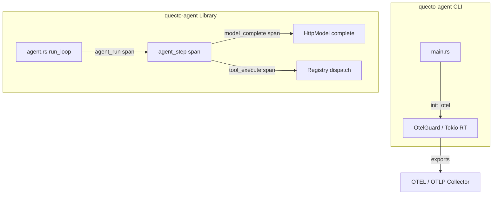

# Spec: OpenTelemetry Tracing Support in Quecto Agent

This document specifies the architecture, data model modifications, instrumentation plan, and setup configuration to support OpenTelemetry (OTEL) tracing in `quecto-agent`. It focuses on capturing overall agent runs, individual execution steps, tool invocations, and LLM completions including intermediate "thinking traces" (reasoning content).

## Requirements

1. **Feature Gating**: Tracing and OpenTelemetry dependencies must be behind an optional Cargo feature `otel` to keep default builds lightweight (as `quecto` prioritizes minimal binary size and compilation time).
2. **Intermediate Thinking Trace**: Capture reasoning content (e.g., DeepSeek style `reasoning_content` field or tags like `<think>...</think>` inside text content) and export it as part of the trace.
3. **OTLP Exporting**: Export traces over OpenTelemetry Protocol (OTLP/HTTP or OTLP/gRPC) configurable via standard OpenTelemetry environment variables (`OTEL_EXPORTER_OTLP_ENDPOINT`, etc.).
4. **Structured Instrumentation**: Implement trace context propagation using the standard Rust `tracing` ecosystem, mapping key agent milestones (step loops, tool dispatches, model calls) to spans.

## Architecture

We will introduce a layered tracing setup:
* **Instrumentation Layer**: Uses standard `tracing` macros (`span!`, `event!`, etc.) inside the library crate (`quecto-agent`). If the `otel` feature is disabled, `tracing` macros compile down to minimal/noop operations or standard logging (depending on configured subscribers).
* **OpenTelemetry Layer**: Conditionally enabled via `#[cfg(feature = "otel")]`. It wires up the `tracing-opentelemetry` subscriber with an `opentelemetry-otlp` exporter.
* **CLI Setup**: The main entry point in `main.rs` initializes the subscriber at startup and flushes remaining spans at shutdown.



## Detailed Specifications

### 1. Data Model Changes (`quecto-agent/src/model.rs`)

To support tracing the LLM's intermediate reasoning, we must parse and store it inside `Message` and `AssistantMessage`.

```rust
pub struct Message {
    pub role: String,
    pub content: String,
    pub tool_calls: Vec<ToolCall>,
    pub tool_call_id: Option<String>,
    pub reasoning_content: Option<String>, // Added field
}

pub struct AssistantMessage {
    pub content: String,
    pub tool_calls: Vec<ToolCall>,
    pub finish_reason: String,
    pub reasoning_content: Option<String>, // Added field
}
```

#### Extraction Strategy (`parse_assistant`):
* Parse `reasoning_content` from standard JSON response (e.g., `choices[0].message.reasoning_content` or `choices[0].message.thinking`).
* Parse `<think>...</think>` tags from `content` string if present:
  ```rust
  fn extract_think_tags(content: &str) -> (Option<String>, String) {
      if let (Some(start), Some(end)) = (content.find("<think>"), content.find("</think>")) {
          if start < end {
              let reasoning = content[start + 7..end].trim().to_string();
              let cleaned_content = format!("{}{}", &content[..start], &content[end + 8..]).trim().to_string();
              return (Some(reasoning), cleaned_content);
          }
      }
      (None, content.to_string())
  }
  ```

---

### 2. Instrumentation Spans & Attributes

All instrumentation will use the standard `tracing` macros. Spans will capture the hierarchical nesting of execution automatically:

| Span Name | Scope | Attributes | Events |
|---|---|---|---|
| `agent_run` | Execution of `Agent::run` / `Agent::resume` | `quecto.task` (if new task)<br>`quecto.model`<br>`quecto.max_steps` | - |
| `agent_step` | Each iteration inside `run_loop` | `quecto.step_number` | - |
| `model_complete` | Model completions (`Model::complete`) | `quecto.messages_sent`<br>`quecto.tools_provided`<br>`quecto.finish_reason`<br>`quecto.tool_calls_count`<br>`quecto.reasoning_content` (if present) | `"model_thinking"` (contains the thinking trace text)<br>`"model_response"` (contains standard response text) |
| `tool_execute` | Tool dispatches (`Registry::dispatch`) | `quecto.tool_name`<br>`quecto.tool_arguments`<br>`quecto.tool_summary` | `"tool_output"` (contains raw output string) |

---

### 3. Exporter Setup & Background Runtime (`quecto-agent/src/main.rs`)

Because `quecto-agent` is a synchronous program, we will spawn a lightweight, single-threaded background `tokio` runtime inside `main.rs` only when `feature = "otel"` is active. This runtime manages async OTLP export threads without polluting the synchronous flow of the agent loop.

```rust
#[cfg(feature = "otel")]
struct OtelGuard {
    _rt: tokio::runtime::Runtime,
}

#[cfg(feature = "otel")]
impl Drop for OtelGuard {
    fn drop(&mut self) {
        opentelemetry::global::shutdown_tracer_provider();
    }
}

#[cfg(feature = "otel")]
fn init_otel() -> Option<OtelGuard> {
    let rt = tokio::runtime::Builder::new_multi_thread()
        .worker_threads(1)
        .enable_all()
        .build()
        .ok()?;
    
    let _guard = rt.enter();

    let tracer = opentelemetry_otlp::new_pipeline()
        .tracing()
        .with_exporter(opentelemetry_otlp::new_exporter().http())
        .install_batch(opentelemetry_sdk::runtime::Tokio)
        .ok()?;

    use tracing_subscriber::prelude::*;
    let telemetry = tracing_opentelemetry::layer().with_tracer(tracer);
    let subscriber = tracing_subscriber::registry().with(telemetry);
    
    tracing::subscriber::set_global_default(subscriber).ok()?;

    Some(OtelGuard { _rt: rt })
}
```

---

### 4. Dependencies (`Cargo.toml`)

Dependencies are kept optional behind the `otel` feature gate:

```toml
[features]
default = []
otel = [
    "dep:tracing",
    "dep:tracing-subscriber",
    "dep:tracing-opentelemetry",
    "dep:opentelemetry",
    "dep:opentelemetry_sdk",
    "dep:opentelemetry-otlp",
    "dep:tokio"
]

[dependencies]
# Existing deps...
tracing = { version = "0.1", optional = true }
tracing-subscriber = { version = "0.3", features = ["env-filter", "registry"], optional = true }
tracing-opentelemetry = { version = "0.22", optional = true }
opentelemetry = { version = "0.21", features = ["trace"], optional = true }
opentelemetry_sdk = { version = "0.21", features = ["rt-tokio"], optional = true }
opentelemetry-otlp = { version = "0.14", features = ["http-proto", "reqwest-client"], optional = true }
tokio = { version = "1", features = ["rt-multi-thread"], optional = true }
```

## Verification & Testing

1. **Mock Verification**: Compile and run unit tests with `--features otel` to verify that message fields, tag parsing, and model extraction logic work perfectly.
2. **Local Trace Visualizations**: Run the agent with an active OTLP endpoint mapping to a local Jaeger container and visually confirm that spans form a correct parent-child execution hierarchy (`agent_run` > `agent_step` > `model_complete` / `tool_execute`).
3. **Footprint Check**: Verify that when compiled without the `otel` feature, the binary output remains lightweight and fast.
